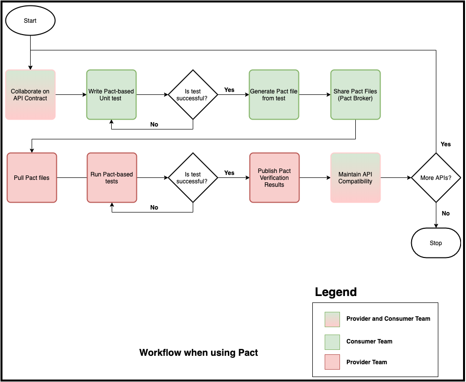
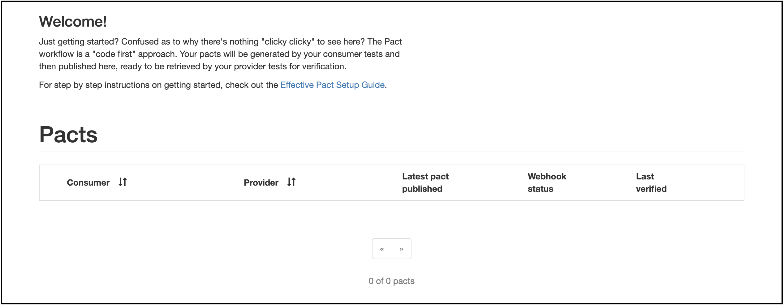
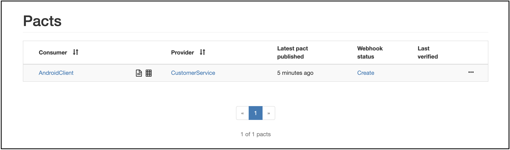
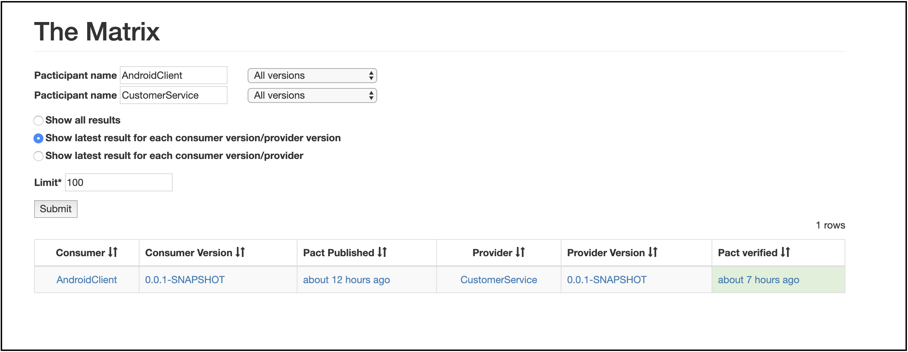

# Contract Testing using Pact-JVM - Workflow and Tutorial

## Introduction
This is a 10-step tutorial to help learn how to do [consumer-driven contract testing](https://martinfowler.com/bliki/ContractTest.html) using the [Pact](https://docs.pact.io/) tool. Each commit in this tutorial progressively explains a particular aspect of how this is intended to work. As part of the tutorial we are building a very simple client (Kotlin) which makes requests GET requests to a customer details service (Java, Spring Boot, R2DBC) which is expected to return first and the last names of a customer given an identifier. For example, an HTTP request like below:
```http request
GET --header "Accept: application/json" /customers/12345
```
is expected to produce output like below:
```json
{
    "id"        : 12345,
    "firstName" : "Test",
    "lastName"  : "First"
}
```
## The Consumer-Driven Contract Workflow - Using Pact
Consumer-driven contract testing requires close collaboration between the consumer and the provider teams. The use of tools like Pact facilitates this collaboration in a positive way. A proposed high level flow when working with Pact (and the approach used in this tutorial) is shown here:

## Pre-requisites
To run the code examples from this tutorial, you will need:
1. JDK 13 installed
2. Kotlin 1.3.x installed
3. Docker 19.x installed
4. Optionally, an IDE such as IntelliJ
5. Run the Pact Broker: The easiest way to do this locally is to checkout the [dockerized pact broker](//github.com/pact-foundation/pact-broker-docker.git) and run `docker compose up` from the command line. If all goes well, you should be able to navigate to http://localhost/ and see the pact broker screen as shown below:

## How to Use the Tutorial
This tutorial is organized in 10 discrete steps. You can choose to checkout and start at any one of these steps depending on the amount of work you want to do yourself. The actual steps in the tutorial itself are outlined below:

Step Number | Description | Start here if you want to
------------|-------------|--------------------------
[Step 01](https://github.com/premanandc/pact-jvm-cdc-tutorial/tree/c2583828cc8069cd7d4ae9411f700cb3d1b59caa) | Client project setup | Do everything on your own from scratch
[Step 02](https://github.com/premanandc/pact-jvm-cdc-tutorial/tree/c0c661febf1af99a402415cf005230d38302e557) | First contract test | Understand how to write a pact and an accompanying consumer driven contract test
[Step 03](https://github.com/premanandc/pact-jvm-cdc-tutorial/tree/7a6432546fe248bb89a342db05d332c5becdd81a) | Sharing the pact with others | Understand how to setup your project to be able to share pacts with others
[Step 04](https://github.com/premanandc/pact-jvm-cdc-tutorial/tree/0a6de6bf40d484bdeee455704c631a39f0cdda34) | Provider implementing the API | Have a starting point with the provider having implemented the API
[Step 05](https://github.com/premanandc/pact-jvm-cdc-tutorial/tree/684266277cbb72f7400788f98bba8bb12db17b52) | Provider honoring the contract | Understand how the provider can pull pacts and honor the contract
[Step 06](https://github.com/premanandc/pact-jvm-cdc-tutorial/tree/0544307a355f9225f5ff8a6270bbd8de12162adb) | Provider publishing the contract verification | Understand the setup required to enable the provider to publish pact verification results
[Step 07](https://github.com/premanandc/pact-jvm-cdc-tutorial/tree/54c8382d3da27dcef3adb2922324a6010b7c24e2) | Reusing pact for other tests | Understand how pacts can be reused to serve as stubs in other testing contexts
[Step 08](https://github.com/premanandc/pact-jvm-cdc-tutorial/tree/3207e921e159d12277b60f885588e1bac2f0ebbc) | Writing less fragile contract tests | Understand how to refactor pacts to rely less on hard-coded values
[Step 09](https://github.com/premanandc/pact-jvm-cdc-tutorial/tree/6bbdf6532e603821a1785a6984f08a1d5dcea175) | Added a second pact for a non-existent customer | Understand how to write pacts to cover additional interactions
[Step 10](https://github.com/premanandc/pact-jvm-cdc-tutorial/tree/c82faeb219b9a2ff9f5562d7e5fae58cd332c6bc) | Accommodating for two styles of provider verification | Understand how you can reduce the amount of integration setup on the provider side

> **Note**: You can checkout the respective step to start from that point or simply compare the evolution of the project between commits.

The significant portions of each step are described in detail below:
 
### [Step 01: Client project setup](https://github.com/premanandc/pact-jvm-cdc-tutorial/tree/c2583828cc8069cd7d4ae9411f700cb3d1b59caa)
This step shows you how to set up a [Kotlin](https://kotlinlang.org/) project for use with [JUnit5](htps://junit.org/junit5/) and[Pact](https://docs.pact.io/) with the [Gradle](htps://gradle.org/) build tool.

To introduce JUnit5 support, add the following to `build.gradle.kts` dependencies
```groovy
testImplementation("org.junit.jupiter:junit-jupiter:5.6.0")
```
To prompt `gradle` to start using JUnit5, add the following:
```groovy
tasks.withType<Test> {
    useJUnitPlatform()
}
```
To introduce pact support, add the following to `build.gradle.kts` dependencies
```groovy
testImplementation("au.com.dius:pact-jvm-consumer-junit5:4.0.6")
```
### [Step 02: First contract test](https://github.com/premanandc/pact-jvm-cdc-tutorial/tree/c0c661febf1af99a402415cf005230d38302e557)
There are two steps to doing this. The team consuming the service, starts by writing a pact, which is essentially an expression of the expectations from the service provider. When working with JUnit5, you need to create a test class and annotate it like below:
```kotlin
@ExtendWith(PactConsumerTestExt::class)
class CustomerServiceContractTests {
    //...
}
```
You then write a method annotated with the `@Pact` annotation. A sample pact is shown below:
```kotlin
@Pact(provider = "CustomerService", consumer = "AndroidClient")
fun getDetailsById(builder: PactDslWithProvider): RequestResponsePact {
    return builder.given("A customer with an existing ID")
            .uponReceiving("a request for customer details")
            .path("/customers/1234")
            .headers(mapOf("Accept" to "application/json"))
            .willRespondWith()
            .headers(mapOf("Content-Type" to "application/json"))
            .body(
                    PactDslJsonBody()
                            .stringType("firstName", "Test")
                            .stringType("lastName", "First")
            )
            .status(200)
            .toPact()
}
```
A few notable things in the code above:
* As part of the `@Pact` annotation, you need to specify values for the `provider` and the `consumer` attributes. The `consumer` is an agreed upon convention to represent your current codebase, and similarly, the `provider` represents the service provider. It is advisable to use the same identifiers for all pacts when referencing the same consumer and producer respectively.
* The `PactConsumerTestExt` extension injects a `PactDslWithProvider` instance into the `getDetailsForExistingCustomerId` method, which provides you with the ability to describe the structure of the request to be made to the service and the response that can be expected back.
* The `given` method on the `builder` accepts a single parameter which is called the **provider state**. The provider state can be thought of as the identifier for your scenario (called an *interaction* in Pact parlance) and can be referenced in other contexts (for e.g. to setup state on the provider prior to verifying the contract).
* The `body` method can be used to describe the structure of either the request (applicable for HTTP methods that require one) or the response body. Pact supports a number of ways to do this. The `PactDslJsonBody` class provides a way to construct a response. To examine other ways in which the response can be created  
This is then followed by writing a **unit test** which asserts the expectations expressed in the pact above. A corresponding sample is shown below:
```kotlin
@PactTestFor(pactMethod = "getDetailsForExistingCustomerId")
@Test
fun testForGetDetailsByIdForExistingCustomer(mockServer: MockServer) {
    //...
}
```
The `pactMethod` attribute of the `PactTestFor` annotation needs to match the name of the method annotated with `@Pact` exactly (otherwise this will result in a test failure). The `PactConsumerTestExt` extension injects a `MockServer` instance, which can be used to make HTTP requests and verify the expectations expressed in the pact.
> **Note**: It is important to note that this is a unit test only. At this stage, there is no correlation (yet) with the provider. However, it does provide a quick and cheap means to validate the expectations expressed in the pact to yourself and your own team.
### [Step 03: Sharing the pact with others](https://github.com/premanandc/pact-jvm-cdc-tutorial/tree/7a6432546fe248bb89a342db05d332c5becdd81a)
Now that you have written your first pact and the accompanying (and passing) unit test, it is time to share this with others (most pertinently with the provider team for verification). When you run your unit tests, Pact creates a *[pact file]*, which describes the interaction(s) codified in your tests in a platform neutral manner. There are a variety of ways to [share the pact file(s)](https://github.com/pact-foundation/pact-ruby/wiki/Sharing-pacts-between-consumer-and-provider). We will use the [Pact Broker](https://github.com/bethesque/pact_broker), a repository (similar to other artifact repositories), purpose built to share pacts, to do this. Assuming that the pact broker is running, you can do this by doing the following in the `build.gradle.kts` file:
1. Introduce the pact plugin
```groovy {.line-numbers}
plugins {
    id("au.com.dius.pact") version "4.0.6"
}
```
2. Configure the `pactPublish` task
```groovy {.line-numbers}
pact {
    publish {
        pactDirectory = "${project.buildDir}/pacts"
        pactBrokerUrl = "http://localhost"
    }
}
```
3. Finally, invoke the task to publish local pacts to the pact broker
```shell script {.line-numbers}
./gradlew clean build pactPublish
```
Assuming that the pact broker is reachable and running, you should see a message similar to:
```shell script
> Task :pactPublish
Publishing 'AndroidClient-CustomerService.json' ... HTTP/1.1 201 Created

BUILD SUCCESSFUL in 1s
1 actionable task: 1 executed
```
If you navigate to the Pact Broker itself, you should see something like below:

### [Step 04: Provider implementing the API](https://github.com/premanandc/pact-jvm-cdc-tutorial/tree/0a6de6bf40d484bdeee455704c631a39f0cdda34)
The provider in this example is a very simple [Spring Boot](https://spring.io/projects/spring-boot) application which uses [webflux](https://docs.spring.io/spring/docs/current/spring-framework-reference/web-reactive.html) and [r2dbc](https://r2dbc.io/) for web API and data access respectively. Look at the [`CustomerController`](https://github.com/premanandc/pact-jvm-cdc-tutorial/blob/master/customer-service/src/main/java/com/thoughtworks/customer/web/CustomerController.java) and the [`CustomerControllerTests`](https://github.com/premanandc/pact-jvm-cdc-tutorial/blob/master/customer-service/src/test/java/com/thoughtworks/customer/web/CustomerControllerTests.java) for details on the implementation of the `GET` customer by id API.
### [Step 05: Provider honoring the contract](https://github.com/premanandc/pact-jvm-cdc-tutorial/tree/684266277cbb72f7400788f98bba8bb12db17b52)
To honor the contract with the client, the provider needs to first pull the pacts (in this case, from the Pact Broker) and then verify each one. To do this, the provider needs to write a test which looks like below:
```java
@ExtendWith(SpringExtension.class)
@SpringBootTest(webEnvironment = RANDOM_PORT)
@Provider("CustomerService")
@PactBroker(host = "localhost", port = "80")
public class AndroidClientIntegrationContractTests {
    @Autowired
    private CustomerRepository repository;

    @LocalServerPort
    private Integer port;

    @State("an existing customer with a valid id")
    void pactWithAnExistingCustomer() {
        Flux.just(1234L)
                .map(id -> new Customer(id, "Test", "First"))
                .flatMap(repository::save)
                .blockLast();
    }

    @BeforeEach
    void setUp(PactVerificationContext context) {
        context.setTarget(new HttpTestTarget("localhost", port));
    }

    @TestTemplate
    @ExtendWith(PactVerificationInvocationContextProvider.class)
    void pactVerificationTestTemplate(PactVerificationContext context) {
        context.verifyInteraction();
    }

}
```
A few notable things in the code above:
* The `@ExtendWith` annotation is standard fare for JUnit5 tests, while `SpringExtention` and `@SpringBootTest` are standard spring boot incantations. It is important to note that this is an integration style test because this does require that the web server be running (on a random port in this case).
* The `@Provider` annotation is part of pact and signifies that we are working with the `CustomerService` provider. Note that this has to match exactly with the value of the `provider` attribute chosen when writing the pact on the consumer side.
* The `@PactBroker` annotation specifies the location of a running Pact Broker which houses all the pacts for this provider. If this is a non-starter, there are other options. Pact simply needs to locate the pact file(s) and allows you to specify the source of your pacts (using the `@PactSource` annotation). This allows loading pact files using other built-in [`PactLoader`](https://www.javadoc.io/doc/au.com.dius/pact-jvm-provider/latest/au/com/dius/pact/provider/junit/loader/PactLoader.html) implementations or writing your own custom ones.
* The [`@State`](https://www.javadoc.io/doc/au.com.dius/pact-jvm-provider/latest/au/com/dius/pact/provider/junit/State.html) annotation helps setup (or teardown) for specific provider states. In this example, we only insert data into the database as part of setup, but don't need any teardown because we are using an in-memory database. 
### [Step 06: Provider publishing the contract verification](https://github.com/premanandc/pact-jvm-cdc-tutorial/tree/0544307a355f9225f5ff8a6270bbd8de12162adb)
To publish verification results back to the Pact Broker, you need to set two system properties `pact.provider.version` and `pact.verifier.publishResults` to the provider's current artifact version and `true` respectively. This can be done when running tests as part of the build. With gradle, this will mean doing something like:
```groovy
tasks.withType<Test> {
    systemProperty("pact.provider.version", version)
    systemProperty("pact.verifier.publishResults", true)
}
```
Or with Maven, something like:
```xml
<plugin>
    <artifactId>maven-surefire-plugin</artifactId>
    <configuration>
        <systemPropertyVariables>
            <pact.provider.version>${project.version}</pact.provider.version>
            <pact.verifier.publishResults>true</pact.verifier.publishResults>
        </systemPropertyVariables>
    </configuration>
</plugin>
```
When verification results are published to the broker, this should appear something like below on the pact broker console:

> Note how the pact interaction captures the exact and respective versions of both the consumer and the provider. This makes it very objective when making deployment decisions to assess compatibility of these components. For more details on how this works, look at the "[can I deploy](https://docs.pact.io/pact_broker/can_i_deploy)" page from the Pact documentation.
### [Step 07: Reusing pact for other tests](https://github.com/premanandc/pact-jvm-cdc-tutorial/tree/54c8382d3da27dcef3adb2922324a6010b7c24e2)
Pact file(s) have enough information to recreate stub scenarios. It will be really nice if we could use these stubs elsewhere in other tests as well (for e.g. to act as a data provider for more expensive UI-based functional tests). The [pact-stub-server](https://github.com/pact-foundation/pact-stub-server) allows us to do just that. Conveniently, this is published as a [docker image](https://hub.docker.com/r/pactfoundation/pact-stub-server/). Combining this with the excellent [testcontainers](https://www.testcontainers.org/) library allows us to make this a part of other kinds of tests as well. An example written in Kotlin is shown below:
```kotlin
@Testcontainers
class CustomerServiceFunctionalTests {
    private val logger = LoggerFactory.getLogger(CustomerServiceFunctionalTests::class.java)
    private val pactBrokerAddress = "172.17.0.1" // IP address of host from the docker container

    @Container
    private val stubContainer: GenericContainer<Nothing> = GenericContainer<Nothing>("pactfoundation/pact-stub-server")
            .apply {
                withExposedPorts(8080)
                withCommand("-u", "http://${pactBrokerAddress}/pacts/provider/CustomerService/consumer/AndroidClient/latest",
                        "-p", "8080")
                withLogConsumer(Slf4jLogConsumer(logger))
            }

    @Test
    fun shouldRunFunctionalTest() {
        val host = stubContainer.containerIpAddress
        val port = stubContainer.getMappedPort(8080)
        val stubServer = "http://$host:$port"
        // Your functional test can now use the stubServer to drive functional and other scenarios!!
    }
}
```
### [Step 08: Writing less fragile contract tests](https://github.com/premanandc/pact-jvm-cdc-tutorial/tree/3207e921e159d12277b60f885588e1bac2f0ebbc)
In Step 02, we wrote our first pact which looked something like below:
```kotlin
@Pact(provider = "CustomerService", consumer = "AndroidClient")
fun getDetailsById(builder: PactDslWithProvider): RequestResponsePact {
    return builder.given("A customer with an existing ID")
            .uponReceiving("a request for customer details")
            .path("/customers/1234")
            .method("GET")
            .headers(mapOf("Accept" to "application/json"))
            .willRespondWith()
            .headers(mapOf("Content-Type" to "application/json"))
            .body(
                    PactDslJsonBody()
                            .stringType("firstName", "Test")
                            .stringType("lastName", "First")
            )
            .status(200)
            .toPact()
}
```
Pact advocates applying [Postel's Law](https://en.wikipedia.org/wiki/Robustness_principle) - *Be conservative in what you do, be liberal in what you accept from others*. In our context, this can be reworded as *Be conservative in what you send (**when composing the request**), be liberal in what you accept (**when processing the response**)*. Keeping this guideline in mind, the pact above can be refactored to read:
```kotlin
@Pact(provider = "CustomerService", consumer = "AndroidClient")
fun getDetailsForExistingCustomerId(builder: PactDslWithProvider): RequestResponsePact {
    return builder.given("an existing customer with a valid id")
            .uponReceiving("a request for an existing customer id")
            .matchPath("/customers/\\d+", "/customers/1234")
            .method("GET")
            .headers(mapOf(ACCEPT to APPLICATION_JSON))
            .willRespondWith()
            .headers(mapOf(CONTENT_TYPE to APPLICATION_JSON))
            .body(
                    PactDslJsonBody()
                            .stringMatcher("firstName", "[A-Z][\\w\\s]+", "Test")
                            .stringMatcher("lastName", "[A-Z][\\w\\s]+", "First")
            )
            .status(SC_OK)
            .toPact()
}
```
Notice how the request and particularly the response now allows the first and last name attributes to match a regular expression as opposed to only accepting a hard-coded value. This and more such guidelines and gotchas are elaborated in the [Pact documentation](https://docs.pact.io/getting_started/matching/gotchas). It will be very useful to be mindful of these when creating more complex pacts for real-world use.
### [Step 09: Added a second pact for a non-existent customer](https://github.com/premanandc/pact-jvm-cdc-tutorial/tree/6bbdf6532e603821a1785a6984f08a1d5dcea175)
The steps are very similar to writing the first pact.
* Start with writing a `@Pact`
```kotlin
@Pact(provider = "CustomerService", consumer = "AndroidClient")
fun getDetailsForNonExistentCustomerId(builder: PactDslWithProvider): RequestResponsePact {
    return builder.given("a non-existent customer with an invalid id")
            .uponReceiving("a request for a non-existent customer id")
            .matchPath("/customers/\\d+", "/customers/112233")
            .method("GET")
            .headers(mapOf(ACCEPT to APPLICATION_JSON))
            .willRespondWith()
            .status(SC_NOT_FOUND)
            .toPact()
}
```
A few notable things in the code above:
* The `@Pact` annotation needs to use the same values for the `provider` and the `consumer` attributes as the other pact we created.
* The provider state (argument to the `builder.given(...)` method) needs to be distinct from all other pacts for this consumer-provider combination.
* The `path` argument is identical to the one specified in the other state we created in Step 02. With this being the case, the pact stub server will randomly return any one of the responses matching the request path. Usually, this is likely to not be the expected behavior. To avoid this, additionally qualify the request using the `state` parameter. For an example, look at [`CustomerServiceFunctionalTests`](https://github.com/premanandc/pact-jvm-cdc-tutorial/blob/master/customer-mobile-client/src/test/kotlin/com/thoughtworks/customer/mobile/client/CustomerServiceFunctionalTests.kt#L23)    
### [Step 10: Accommodating for two styles of provider verification](https://github.com/premanandc/pact-jvm-cdc-tutorial/tree/c82faeb219b9a2ff9f5562d7e5fae58cd332c6bc)
In Step 05, we populated the provider database with data to match the state expectations of the interaction. However, this can get pretty cumbersome if your provider has quite a bit of expensive setup (it is another matter that your service probably shouldn't have too many dependencies. But we'll leave that discussion for some other time). An alternate implementation which mocks the `CustomerRepository` does not require this kind of (relatively) expensive database setup. This looks something like below:
```java
public class AndroidClientMockContractTests extends AbstractAndroidClientContractTests {

    @MockBean
    private CustomerRepository repository;

    @State("an existing customer with a valid id")
    void pactWithAnExistingCustomer() {
        when(repository.findById(1234L))
                .thenReturn(Mono.just(new Customer(1234L, "Test", "First")));
    }
}
```
> Look at [AndroidClientIntegrationContractTests](https://github.com/premanandc/pact-jvm-cdc-tutorial/blob/master/customer-service/src/test/java/com/thoughtworks/customer/web/AndroidClientIntegrationContractTests.java), [AndroidClientMockContractTests](https://github.com/premanandc/pact-jvm-cdc-tutorial/blob/master/customer-service/src/test/java/com/thoughtworks/customer/web/AndroidClientMockContractTests.java) and [AbstractAndroidClientContractTests](https://github.com/premanandc/pact-jvm-cdc-tutorial/blob/master/customer-service/src/test/java/com/thoughtworks/customer/web/AbstractAndroidClientContractTests.java) for more details.
## 